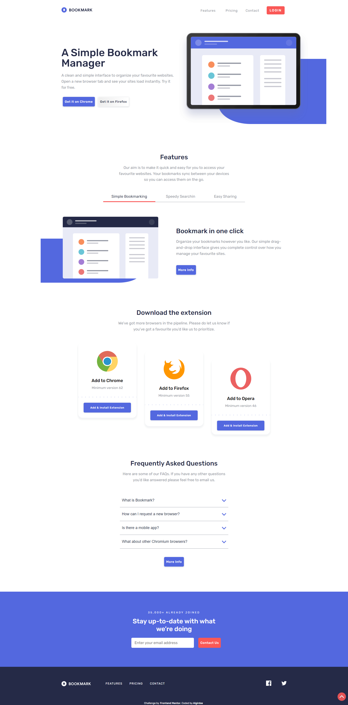
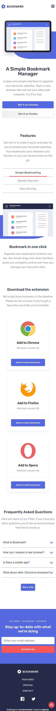
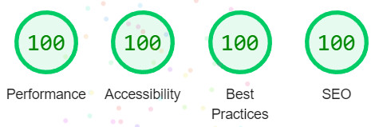
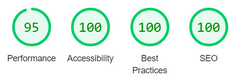

# Frontend Mentor - Bookmark landing page solution

This is a solution to the [Bookmark landing page challenge on Frontend Mentor](https://www.frontendmentor.io/challenges/bookmark-landing-page-5d0b588a9edda32581d29158). Frontend Mentor challenges help you improve your coding skills by building realistic projects. 

## Table of contents

- [Overview](#overview)
  - [The challenge](#the-challenge)
  - [Screenshot](#screenshot)
  - [Links](#links)
- [My process](#my-process)
  - [Built with](#built-with)
  - [What I learned](#what-i-learned)
- [Author](#author)

## Overview

### The challenge

Users should be able to:

- View the optimal layout for the site depending on their device's screen size
- See hover states for all interactive elements on the page
- Receive an error message when the newsletter form is submitted if:
  - The input field is empty
  - The email address is not formatted correctly

### Screenshot

### Links

- Solution URL: (https://github.com/AlgirdasU/Bookmark-landing-page)
- Live Site URL: (https://timely-hummingbird-4dbe34.netlify.app/)

## My process

### Built with

- Semantic HTML5 markup
- CSS custom properties
- SCSS
- Flexbox
- Mobile-first workflow
- BEM
- JS

### What I learned

With each new challenge I feel more comfortable learning css/scss, but still need to improve my javascript knowledge. I learned how to create an Accordion using CSS/SCSS & Vanila JavaScript and how to switch Tabs.
To see how you can add code snippets, see below:

## Author

- Website - [Algirdas](https://github.com/AlgirdasU/Bookmark-landing-page)
- Frontend Mentor - [@Algirdase](https://www.frontendmentor.io/home/my-challenges)
- Twitter - [@AlgirdasDdd](https://twitter.com/algirdasddd)